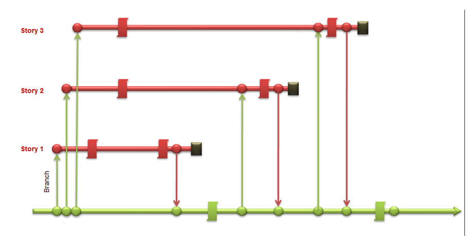

--- 
layout: post 
title: "Why I Hate GitFlow Branching" 
description: "GitFlow branching vs story branching" 
categories:  
author: "Chris Hudson" 
meta: "" 
--- 

# TLDR; 
## Full GitFlow process
- Doesn't lead well to CI/CD nor does it scale across large number of applications in seperate repos. 
- Process causes large number of merge conflicts slowing development time 
- Pncreases possibilities of re-introducing production impacting hotfixes. 
- It increases complexity with integration testing as you increase the number of applications using the model.
- The model does not encourage the use of feature toggles slowing MVP time to market. 
- Feature isolation testing increases the testing environments that need to be created/maintained increasing support costs and slowing down delivery.

# GitFlow Overview

Flow: 11 steps
    
    Master ==> Development ==> Feature ==> Local Dev ==> Feature ==> Development ==> Release ==> Master ==> Development ==> All Features ==> Local Dev

HotFix Flow (7 Steps)
    HF --> Local Development -> HF --> Master --> Release --> Development --> ALL Features 
 
    
## Master Branch 
tracks released code only merges from release branches and hotfix branches only, long lived branch

## Development Branch
code base for completed features, long lived branch
- Branched from master  
- Merged into Release Branch

## Feature Branch
new development, non critical bugs, enhancements, branch only lives until feature is code complete
- Branched from Development branch
- Merged into Development

## Hot Fix Branch
code to fix production incidents, branch only lasts to confirm code
- branched directly from Master
- Merges into Master AND development AND all Feature Branches

## Release Branch
this is code staged for deployment, code here is deployed to test environment, problems are corrected and retested. Code is then merged into master
- branched from development branch
- Merges into Master AND development And all Feature Branches

# Story Branching Overview - Simplified Alternative to GitFlow

Flow: 5 steps

    Master ==> UserStoryBranch ==> Local Dev ==> User Story Branch ==> Master

Hotfixes follow the same flow 
    Master ==> HFBranch ==> Local Dev ==> HFBranch ==> Master

    
[CI process] 

    Build ==> Run unit tests ==> Deploy Test ==> Run functional/integration/stress/perf/load tests ==> promote to production

- Anything in the master branch is deployed to production.
- To work on something new, create a descriptively named branch off of master (ie: US234)
- Commit to that branch locally and regularly push your work to the same named branch on the server
- When you need feedback or help, or you think the branch is ready for merging, open a pull request
- After someone else has reviewed and signed off on the feature, then the changes will be merged it into master branch. Once it is merged and pushed to ‘master’, you can and should deploy immediately (CI/CD).

# Learn More
[Ref:](https://www.richard-banks.org/2011/02/branch-per-story-pattern-and-tfs.html)
[Introducing GitFlow](https://datasift.github.io/gitflow/IntroducingGitFlow.html)
 
