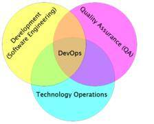
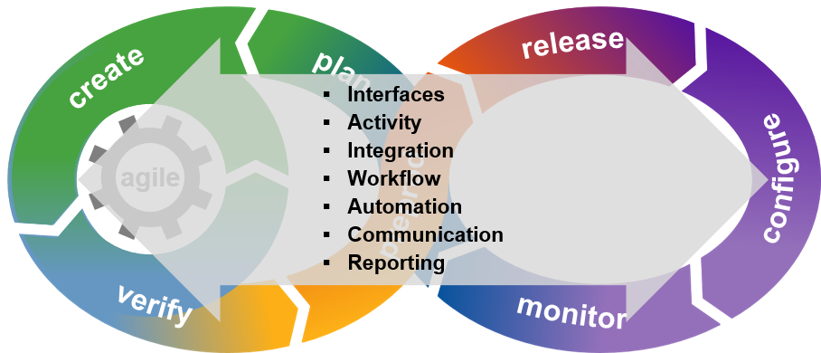

--- 
layout: post 
title: "What is DevOps" 
description: "Devops definintion and culture of Devops" 
categories:  Devops
author: "Chris Hudson" 
meta: "" 
--- 

# What is Devops 
- Culture blending devolopment and operations tasks to better promote communication, ownership, and accountability. 
- example operation teams include system adminstration, production support, network services, and SecInfo.
- view the entire software delivery chain to delivery higher quality, faster delivery of applications to its users.
- Automation is the core principle of Devops this allows us to achieve a repeatable process which we can continue to enhance.

[Devops](https://searchitoperations.techtarget.com/definition/DevOps)

# Objective
The objective of a DevOps toolchain is to enable the perpetual delivery of applications efficiently, in line with the expectations of the business. 
The orchestration of the toolchain aims to provide holistic visibility and control to effectively meet that objective, while masking the underlying tools complexity.

To support the delivery of applications to the business, there are functions that flow throughout the toolchain that orchestration should unify:

- Interfaces. Providing different roles with the ability to see the status of specific or overall pipeline activity.
- Activity. Continuous monitoring and evaluation throughout the entirety of the toolchain from planning, through development and into live production — showing the steps and activities in each phase of the toolchain.
- Integration. Comprising two or more tools passing and sharing data to support synergistic activities (for example, create and verify or release and configure). Integration is typically between neighboring tools in the toolchain.
- Workflow. Defining the systematic organization and sequencing of actions, and coordination of required resources to execute the DevOps activities. Managing the handoffs between tools the actions taken.
- Automation. Using technology to routinize the execution of activities or a process response to an event, request or other trigger, reducing/eliminating the need for human interaction.
- Communication. Enabling efficiency, and identifying and removing constraints through the toolchain, promoting awareness and collaboration between DevOps team members.
- Reporting. Detailing specific or cross-toolchain activity for accountability and evaluation purposes.

# CALMS
The CALMS framework is often used as a maturity model. The acronym CALMS is credited to Jez Humble, co-author of "The DevOps Handbook."

The five pillars of the CALMS framework for DevOps are:

- Culture: there is a culture of shared responsibility.
- Automation:  team members seek out ways to automate as many tasks as possible and are comfortable with the idea of continuous delivery.
- Lean:  team members are able to visualize work in progress (WIP), limit batch sizes and manage queue lengths. 
- Measurement: data is collected on everything and there are mechanisms in place that provide visibility into all systems.
- Sharing: there are user-friendly communication channels that encourage ongoing communication between development and operations.

The CALMS framework is sometimes considered an alternative to ITSM (Information Technology Service Management), a strategic approach to designing, delivering, managing and improving the way IT is used within an organization. 
ITSM, which is often associated with ITIL (Information Technology Infrastructure Library) is considered by some IT administrators to be too rigid and therefore incompatible with DevOps. 
CALMS is sometimes thought of as a way of negotiating the differences between the two approaches.

# Learn More
- https://www.gartner.com
- [CALMS](https://whatis.techtarget.com/definition/CALMS)
